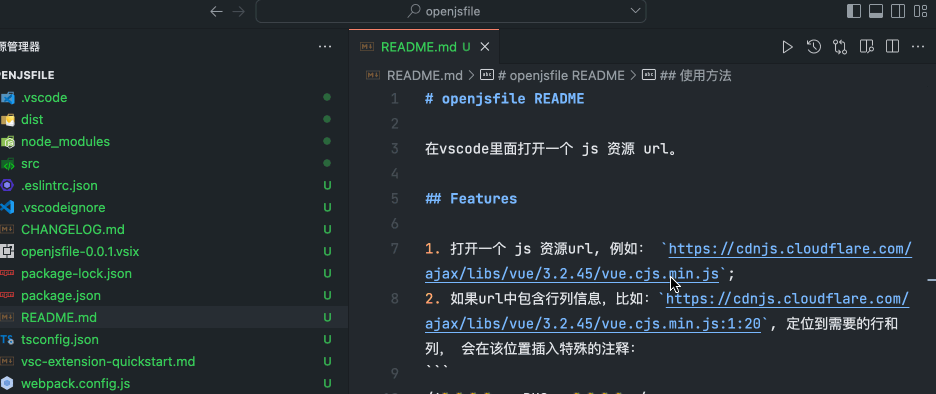

# openjsfile README

在vscode里面打开一个 js 资源 url。

## Features

1. 打开一个 js 资源url, 例如： `https://cdnjs.cloudflare.com/ajax/libs/vue/3.2.45/vue.cjs.min.js`;
2. 如果url中包含行列信息，比如：`https://cdnjs.cloudflare.com/ajax/libs/vue/3.2.45/vue.cjs.min.js:1:20`, 定位到需要的行和列， 会在该位置插入特殊的注释：
```
/*🐛🐛🐛🐛===BUG===🐛🐛🐛🐛*/
```

## 使用方法

1. `cmd+shift+p`
2. input `Open js url`
3. finally input js url；




**Enjoy!**
